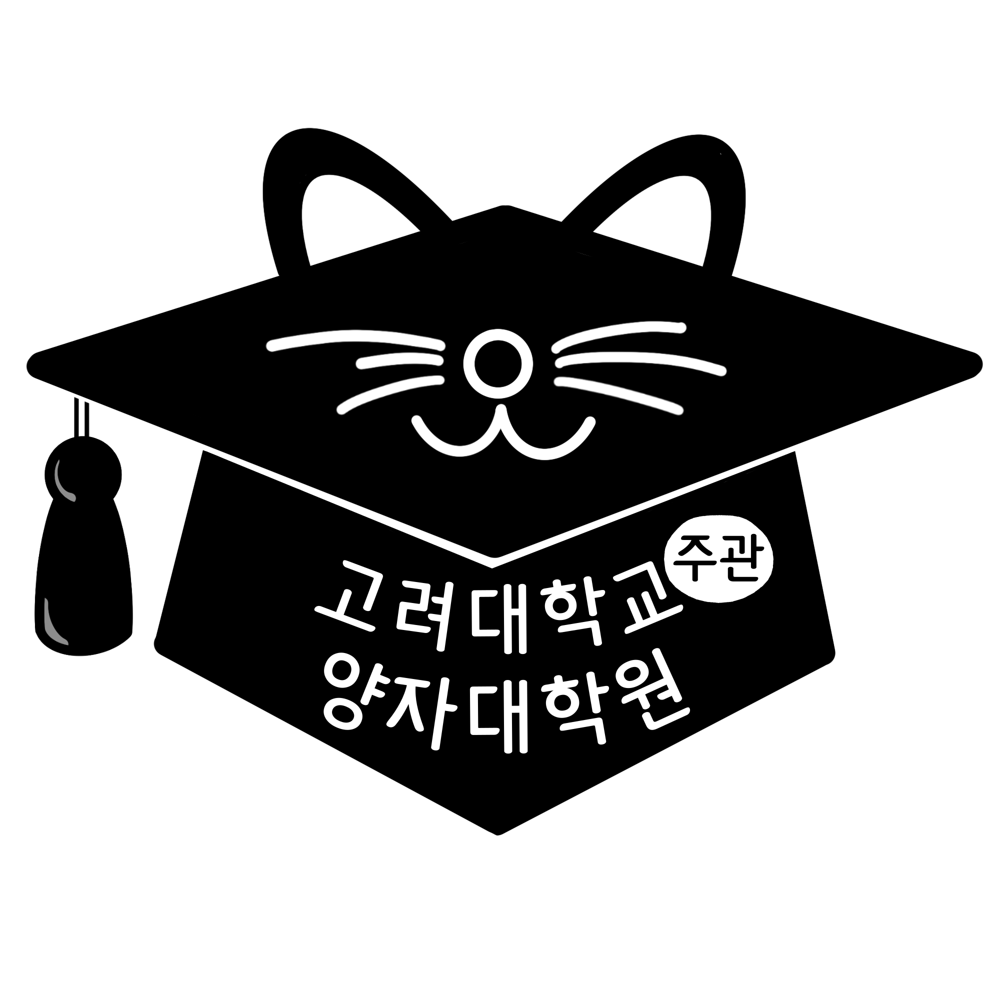
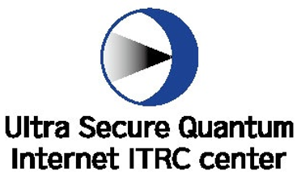
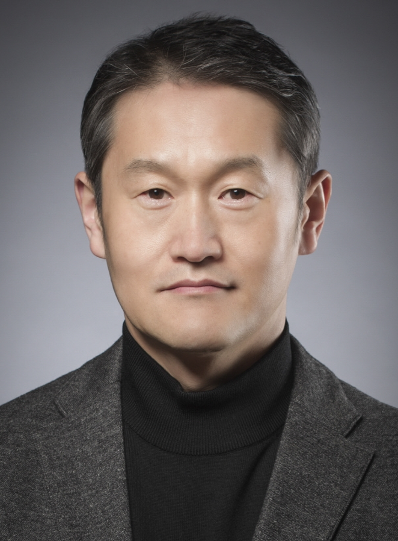
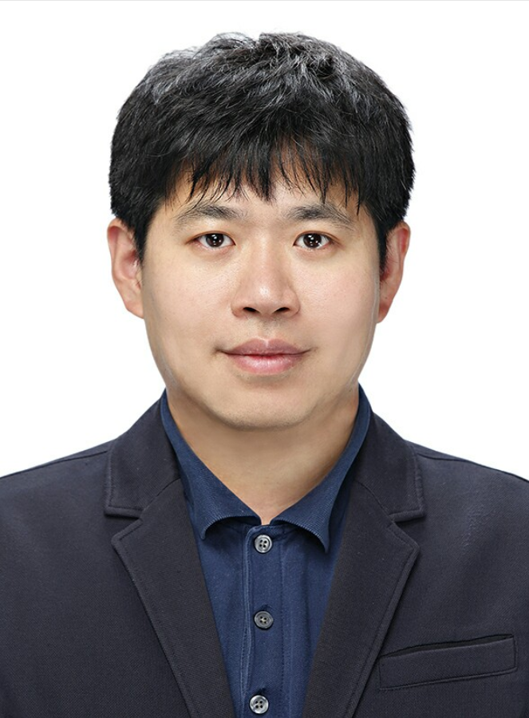
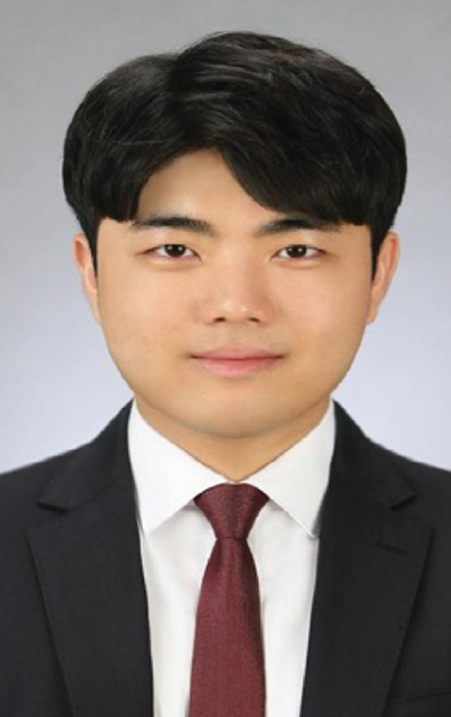
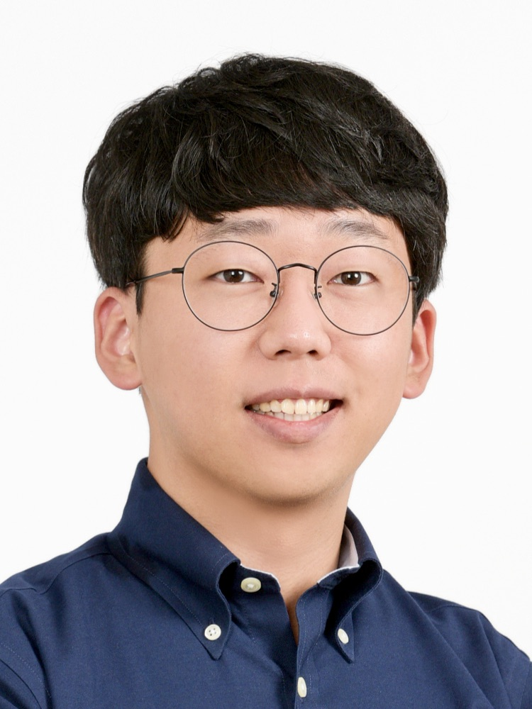

# qiskit-fall-fest-2023ku

## 환영합니다!

Qiskif Fall Fest at Korea University 행사 안내 페이지입니다. 관심을 갖고 이 페이지를 봐주셔서 감사합니다! 이 행사는 IBM Quantum 의 도움을 받아 진행되며, 고려대학교 양자정보과학 학술동아리 [QUICK](https://quick-website.github.io/)(QUantum Information Club at Korea University)에서 주최합니다. 이 행사는 고려대학교 학생들만을 위한 행사입니다!

Qiskit은 클라우드 시스템을 통해 양자 컴퓨터에 접근하고 양자 회로를 설계할 수 있도록 설계된 IBM이 개발한 오픈 소스 양자 컴퓨팅 프레임워크입니다.

양자컴퓨터에 잘 모르는 학생들이 양자컴퓨터에 관심을 가질 수 있도록 도와주는 것이 이번 행사의 목적입니다. "Challenge"의 형태로 행사를 진행할 예정이며, 참가자들은 도전 문제를 차근차근 풀어나가면서 양자컴퓨터를 다룰 수 있게 됩니다.

"Challenge" 란, 주최측이 제시하는 문제들을 풀어나가는 행사를 말합니다. 도전 문제들은 양자컴퓨터를 전혀 몰랐던 학생들도 풀 수 있는 아주 기본적인 문제를 시작으로 난이도가 점차 높아질 것입니다. 문제가 제시되기 전, 문제를 풀기 위해 알아야할 내용에 대한 설명도 문제와 함께 제시가 될 것입니다. 제공 되는 설명들을 보며 도전 문제를 풀어나가다보면, 양자컴퓨터를 활용하는 기초적인 능력을 갖추게 될 것입니다. 본격적인 "Challenge"를 하기 전에도 양자컴퓨터 분야를 소개하고 Qiskit 을 이용하여 코딩하는 방법을 알려주는 워크숍도 진행됩니다.

Qiskit Fall Fest at Korea University에서 참가자분들을 만나 뵐 수 있기를 기대하며, 양자컴퓨터에 대해 잘 모르시는 분도 환영합니다! 양자컴퓨터가 무엇인지 궁금하신 분들은 주저하지 마시고 신청해주세요!

금전적, 행정적인 지원을 해주신 고려대학교(주관) 양자대학원에 감사 인사 드립니다.

## Support

## 일정

### 전체적인 일정표

| 시간(KST)                | 진행 방식 및 장소  | 내용        | 비고                                                  |
| ------------------------ | ------------------ | ----------- | ----------------------------------------------------- |
| 11/4(토) 10:00~12:00 AM  | online             | 킥오프 미팅 | 실시간 참여 혹은 녹화본 11/5(일) 오후 6시 전까지 시청 |
| 11/5(일) 7:00~9:00 PM    | online             | 워크숍 1    | 실시간 참여 혹은 녹화본 11/6(월) 자정까지 시청        |
| 11/7(화) 7:00~9:00 PM    | offline(place TBD) | 워크숍 2    | 오프라인으로 필수 참여                                |
| 11/11(토) 10:00~12:00 AM | online             | 워크숍 3    | 실시간 참여 혹은 녹화본 11/17(금) 자정까지 시청       |
| 11/14(화) 7:00~9:00 PM   | online             | 워크숍 4    | 실시간 참여 혹은 녹화본 11/17(금) 자정까지 시청       |
| 11/18(토) 10:00~18:30    | offline(place TBD) | Challenge   |                                                       |

**온라인으로 진행되는 워크숍 녹화본은 각 워크숍 이후 제공될 예정입니다.**

**위 표의 비고란에 적힌 내용을 따르지 않을 경우 Challenge 참여가 제한될 수 있습니다**

### ✨ 킥오프 미팅 ✨

_Session Details: 11/4/2023(토), online, 10:00~12:00_

킥오프 미팅은 행사 주최자와 행사 참여자들이 온라인 상에서 처음으로 만나는 자리입니다. Qiskit Fall Fest at Korea University 의 자세한 일정에 대한 안내와 주의사항에 대해 안내드릴 예정입니다. 양자컴퓨터의 역사와 양자컴퓨터의 필요성에 대해서도 가볍게 다룰 것입니다.

### 💡Qiskit Fall Fest 워크숍 1: 기초적인 선형대수 및 양자 회로 구성법 💡

_Session Details: 11/5/2023(일), online, 19:00~21:00_

첫번째 워크숍에서는 양자컴퓨터에서 연산이 어떻게 작동하는지 이해하기 위해서 필요한 수학적 배경지식 대하여 설명드릴 예정입니다. 이 시간에는 기초 선형대수, 단일 큐빗, 다중 큐빗 상태에 대해 배울 예정입니다. 고등학교 수학 정도만 알고 있어도 내용을 이해하시는데 큰 어려움이 없을 것입니다. 만약 이공 계열 1학년 수업인 미적분학을 수강하셨거나, 선형대수를 배우신 적 있다면 더 이해하기 쉬우실 것입니다.

### 💡Qiskit Fall Fest 워크숍 2: 양자컴퓨터로 무엇을 할 수 있을까?💡

_Session Details: 11/7/2023(화), offline(place TBD), 19:00~21:00_

두번째 워크숍에서는 양자컴퓨터를 이용하여 우리가 무엇을 할 수 있는지, 그리고 양자컴퓨터 관련된 연구분야는 어떠한 것들이 있는지 소개해드릴 예정입니다. 양자정보과학 분야에서 연구하시는 연구원분들을 초빙하여 진행할 예정입니다.
연구원분들께서 진행하고 계신 분야에 대한 소개 및 양자컴퓨터를 사용하여 진행하였던 재미있는 프로젝트에 대해 말씀해주실 예정입니다.

이 시간에 저희는 양자 원격 전송(Quantum Teleportation), 그로버 알고리즘(Grover's Algorithm) 내용도 다룹니다.

### 💡Qiskit Fall Fest 워크숍 3: Qiskit 사용 방법💡

_Session Details: 11/11/2023(토), online, 10:00~12:00_

세번째 워크샵에서는 Qiskit 개발 환경을 설정하고 IBM의 양자 컴퓨터 및 시뮬레이터에서 양자 회로를 실행하는 방법에 대해 설명합니다.

### 💡Qiskit Fall Fest 워크숍 4: Challenge 행사 시작 전 어떠한 것들을 준비하면 좋을까?💡

_Session Details: 11/14/2023(화), online, 19:00~21:00_

네번째 워크숍에서는 11/18(토)에 진행되는 Challenge 행사에서 제시되는 도전문제 유형을 안내하고 도전문제 예시를 함께 풀어봅니다. 또한 Challenge 행상 전에 Qiskit과 양자컴퓨팅에 대해 공부하기 좋은 자료를 추천해드립니다.

### 🎉 Challenge: Main Event 🎉

_Event Details: 11/18/2023(토), offline(place TBD), 10:00~18:30_

| time        | content                          |
| ----------- | -------------------------------- |
| 10:00~10:30 | 개회                             |
| 10:30~11:00 | 도전 문제 공개 및 개발 환경 세팅 |
| 11:00       | 도전 문제 풀기 시작              |
| 12:30       | 점심식사 제공                    |
| 17:30       | 도전 문제 풀기 마감              |
| 17:30~18:00 | 시상식                           |
| 18:00~18:30 | 행사 후 설문 및 마무리           |

## 연사 소개

### 워크숍2

#### 허준 교수님, 고려대학교 전기전자공학부

_11/7/2023(화) 19:00_

주제:
- 양자정보과학 분야 소개 및 연구 동향 & CIS 연구실 소개
<!--

#### OOO 연구원님, 고려대학교 전기전자공학부

_11/7/2023(화) 19:40_

주제:
- Quantum Teleportation
- Grover's Algorithm
-->
|  |  |
| ----------------------------------------------------------------- | ----------------------------------------------------------------- |

#### 김중헌 교수님, 고려대학교 전기전자공학부(좌)
#### 백한결 연구원님, 고려대학교 전기전자공학부(우)

_11/7/2023(화) 20:30_

주제:
- 양자인공지능 분야 소개 및 AIM 연구실 소개
- 양자인공지능 Application (Quantum Convolutional Neural Network 관점)
- 그외 양자 컴퓨팅 관련된 재밌는 이야기들 (발전방향/Pros and Cons)

### Challenge 개회

#### 김요셉 교수님, 고려대학교 물리학과

_11/18/2023(토) 10:00_

주제:
- Challenge 개회 축하
- 고려대학교(주관) 양자대학원 및 ScQI 연구실 소개
- 실험물리학자 관점에서의 양자정보과학

## ❗안내사항❗

### 이 행사에 참여하기 위해 필요한 배경지식

- 코딩 경험(어떠한 프로그래밍 언어든지 상관 없습니다)
  - 조건문, 반복문, 함수에 대하여 알고 계시면 됩니다.
- 고등학교 수준의 수학
  - 확률이 무엇인지, 스칼라와 벡터의 차이가 무엇인지 알고 계시면 됩니다.

### 참가자 준비물

- 개인 노트북, 충전기

### 참가자에게 제공되는 물품

- 중식, 다과
- 기념품
- 수료증(IBM, 고려대학교(주관) 양자대학원)

### IBM Quantum Community [행동강령](https://github.com/Qiskit/qiskit/blob/main/CODE_OF_CONDUCT.md)

### 등록

- 마감기한: 10/31/2023(화) 23:59
- 참가비: 10,000원(등록 마감 이후 메일을 통해 개별적으로 납부 안내할 예정)
- 최대 40명 모집
- 신청자가 많을 경우 조기 마감될 수 있습니다.
- 신청서를 성실히 작성하지 않으신 경우 Qiskit Fall Fest 참여가 어려우실 수 있습니다.
- 참가 신청서: [Google form](https://forms.gle/RgD4hvSwJkNuctLY9)

### 시상품

- 상위 5명에게 Qiskit Swag package(Qiskit 관련 기념품) 및 상장 수여
- 상위 3명에게 상금 수여

### 문의사항 있는 경우

- 아래의 링크를 통해 카카오톡 오픈채팅방에서 문의해주시거나 e-mail을 통해 문의해주시길 바랍니다.
- https://open.kakao.com/o/sHtfMOKf
- e-mail: kuquickofficial@gmail.com

* * *

## Welcome!!

This is the Qiskit Fall Fest at Korea University event page. Nice to meet you all! This event is hosted by QUICK(QUantum Information Club at Korea University) and supported by IBM Quantum.

Qiskit is an open-source quantum computing framework developed by IBM that is designed to access quantum computers and design circuits through cloud systems.

The purpose of this event is to encourage students who are not familiar with quantum computers to become interested in the field of quantum computers. We will proceed with the event in the form of a "challenge", and participants will be able to deal with quantum computers as they solve the challenge problems step by step.

Challenge problems will grdually increase in difficulty, starting with very basic ones that can be solved even by students who have no knowledge of quantum computers. Before starting the challenge, a workshop will also be held to introduce the quantum computer field and teach how to code qiskit.

We look forward to seeing the participants. You don't have to know much about quantum computers, so please don't hesitate to apply if you're curious about what quantum computers are!

## Support

## Schedule

### Summarized timetable

| Time(KST)              | type & place       | content         | note                                                                     |
| ---------------------- | ------------------ | --------------- | ------------------------------------------------------------------------ |
| 11/4(Sat) 10:00~12:00  | online             | kickoff meeting | Participate in real-time or watch the recording until 18:00 on 11/5(Sun) |
| 11/5(Sun) 19:00~21:00  | online             | Workshop1       | Participate in real-time or watch the recording until 23:59 on 11/6(Mon) |
| 11/7(Tue) 19:00~21:00  | offline(place TBD) | Workshop2       | Participate in offline                                                   |
| 11/11(Sat) 10:00~12:00 | online             | Workshop3       | Participate in real-time or watch the recording until 23:59 on 11/17(금) |
| 11/14(Tue) 19:00~21:00 | online             | Workshop4       | Participate in real-time or watch the recording until 23:59 on 11/17(금) |
| 11/18(Sat) 10:00~18:30 | offline(place TBD) | Challenge       | main event                                                               |

**A recording of the online workshop will be available after each workshop.**

### ✨ Kickoff meeting ✨

_Session Details: 11/4/2023(Sat), online, 10:00~12:00_

Kickoff meeting is the first time the event organizers and participants meet online. It is a time to inform participants of detailed event schedule and precautions for participants. And introduce what quantum computers are.

### 💡Qiskit Fall Fest Workshop 1: Introduction to Linear Algebra and Circuit Composition. 💡

_Session Details: 11/5/2023(Sun), online, 19:00~21:00_

Our first workshop will cover mathematical background knowledge you need to know to understand how quantum computers work. It will deal with basic linear algebra, single qubit, and multiple qubits.

### 💡Qiskit Fall Fest Workshop 2: What can we do with quantum computers?💡

_Session Details: 11/7/2023(Tue), offline(place TBD), 19:00~21:00_

The second workshop will cover what we can do using quantum computers and what are the detailed research areas related to quantum computers.
We invite researchers in quantum information science as speakers. They will give an overview of the field they are studying. And they will introduce interesting projects that they have worked on and explain the experience of using quantum computers.

We will deal with Quantum teleportation, and Grover's Algorithm too!

### 💡Qiskit Fall Fest Workshop 3: How to use Qiskit?💡

_Session Details: 11/11/2023(Sat), online, 10:00~12:00_

Our Thrid workshop will cover how to setup your Qiskit environment and run your quantum circuit on IBM's quantum computers and simulators.

### 💡Qiskit Fall Fest Workshop 4: What do you have to prepare before starting the challenge?💡

_Session Details: 11/14/2023(Tue), online, 19:00~21:00_

In workshop4, we will guide the type of challenge problem and solve the challenge problem example together. Also, We will recommend some good materials to study about Qiskit and quantum computing before the challenge.

### 🎉 Challenge 🎉

_Event Details: 11/18/2023(Sat), offline(place TBD), 10:00~18:30_

| time        | content                                                     |
| ----------- | ----------------------------------------------------------- |
| 10:00~10:30 | Opening                                                     |
| 10:30~11:00 | Challenge Problem Disclosure and Setting Qiskit Environment |
| 11:00       | Starting to solve challenge problem                         |
| 12:30       | Having lunch                                                |
| 17:30       | Deadline of Challenge Problem Solving                       |
| 17:30~18:00 | Awards ceremony                                             |
| 18:00~18:30 | Post event survey & Additional resources                    |

## Guest Speaker

### Workshop 2

#### Professor Jun Heo, Korea University

_11/7/2023(Tue) 19:00(KST)_

Title:
- Introduction to Quantum Information Science and Research Trends
<!-- 

#### OOO, 고려대학교 전기전자공학부

_11/7/2023(화) 19:40_

Title:
- Quantum Teleportation
- Grover's Algorithm
-->
|  |  |
| ----------------------------------------------------------------- | ----------------------------------------------------------------- |

#### Professor Joongheon Kim, Korea University(left)
#### Hankyul Baek, Korea University(right)

_11/7/2023(Tue) 20:30_

Title:
- Introduction to Quantum Artificial Intelligence and AIM Laboratory
- Application of Quantum Artificial Intelligence
- Interesting Stories About Quantum Computing (the direction of development, Pros and Cons)

### Challenge opening

#### Professor Yosep Kim, Korea University

_11/18/2023(Sat) 10:00_

Title:
- Celebrating the Opening of the Challenge
- Introduction of Quantum Workforce Center and ScQI Laboratory
- Quantum Information Science from the Perspective of an Experimental Physicist

## ❗Attendee Guide❗

### Background knowledge that participants need to know

- Basic coding experience(Regardless of the programming language)
  - Conditional statements, iterations, functions
- Mathematical background
  - you have to know concept of probability, vector and scalar

### What Participants Should Prepare

- Personal laptop, charger

### What we offer to the participants

- lunch, snack

### IBM Quantum Community [Code of Conduct Guidelines](https://github.com/Qiskit/qiskit/blob/main/CODE_OF_CONDUCT.md)

### Registration

- Deadline: 10/31/2023(Tue) 23:59
- Participation fee: KRW 10,000 (Payment will be notified individually through e-mail after registration deadline)
- The maximum number of participants is 40
- Event applications may close early if there are many applicants
- Participation in the Qiskit Fall Fest may be difficult if the application is not faithfully filled out
- Registration form: [Google form](https://forms.gle/RgD4hvSwJkNuctLY9)

### Award

- Qiskit Swag Package and certificate of award to the Top 5 scorers
- Cash prize to the Top 3 scorers

### If you have any questions

- Please contact us at the Kakao Talk open chat room through the link below or via e-mail.
- https://open.kakao.com/o/sHtfMOKf
- e-mail: kuquickofficial@gmail.com
